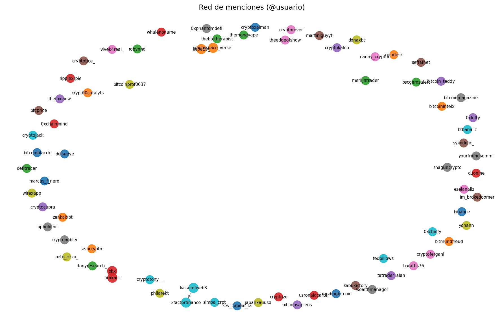

# Práctica U6 — Análisis de redes sociales con NetworkX y LLM

## Descripción

Este proyecto amplía el trabajo de la **Unidad 4** (minería de textos sobre tweets) con un
evolutivo de la **Unidad 6**: modelado de **redes de interacción** con NetworkX e
**interpretación asistida por un LLM local** (Gemma).

A partir de un corpus de tweets sobre **Bitcoin**, el sistema:

1. Carga y limpia los textos.
2. Construye un grafo dirigido de menciones `@usuario`.
3. Calcula métricas de centralidad, densidad y comunidades (Louvain).
4. Genera un prompt estructurado con los insights de la red.
5. Permite conversar con el modelo para obtener un análisis interpretativo.

Toda la lógica se organiza en la clase `DataExtractor`, refactorizada en **mixins**
por responsabilidad para facilitar el mantenimiento y la extensión.

---

## Arquitectura

```
main.py
   └── DataExtractor (extractor/core.py)
         ├── DataLoadingMixin    → CSV, JSON, RapidAPI
         ├── TextAnalysisMixin   → limpieza, hashtags, keywords
         ├── NlpAnalysisMixin      → LDA, sentimiento, spaCy, resumen
         ├── ExportMixin           → exportación CSV / TXT
         ├── NetworkAnalysisMixin  → grafo, métricas, prompt de red
         └── LlmMixin              → chat local con transformers
```

El punto de entrada histórico `data_extractor.py` reexporta `DataExtractor` para
mantener compatibilidad con imports anteriores.

### Pipeline de la Unidad 6

`execute_pipeline()` orquesta el flujo sin reprocesar pasos:

```
load_data()
    ↓
clean_data()
    ↓
build_interaction_graph()
    ↓
analyze_network()
    ↓
generate_prompt_from_network()
    ↓
chat_local_llm()
```

---

## Instalación

### Requisitos previos

- **Python 3.11** o **3.12** (`requires-python` en `pyproject.toml`; no compatible con 3.14 por spaCy/NLP).
- En Windows, usar el launcher: `py -3.11`.

### Entorno virtual (recomendado)

```powershell
py -3.11 -m venv .venv
.\.venv\Scripts\activate
py -3.11 -m pip install -r requirements.txt
```

### Modelo spaCy (solo si usas funciones NLP de la U4)

```powershell
py -3.11 -m spacy download en_core_web_sm
```

### LLM local (Gemma)

El modelo `google/gemma-4-E2B-it` se descarga automáticamente la primera vez.
Debes **aceptar la licencia** en [Hugging Face](https://huggingface.co/google/gemma-4-E2B-it)
e iniciar sesión en el CLI si el repositorio es privado/gated:

```powershell
pip install huggingface_hub
huggingface-cli login
```

---

## Dependencias principales

| Librería | Uso |
|----------|-----|
| `pandas` | Carga y manipulación del corpus |
| `networkx` | Construcción y análisis del grafo |
| `matplotlib` | Visualización del grafo y gráficos U4 |
| `transformers`, `torch`, `accelerate` | Inferencia local del LLM |
| `gensim`, `textblob`, `nltk`, `spacy` | NLP (Unidad 4) |
| `wordcloud`, `requests`, `python-dotenv` | Wordcloud, RapidAPI, variables de entorno |

Listado completo en `requirements.txt`.

---

## Configuración

Copia `.env.example` a `.env` si vas a usar RapidAPI:

```env
RAPIDAPI_KEY=tu_clave
RAPIDAPI_HOST=twitter-api45.p.rapidapi.com
```

Suscríbete a [Twitter API45 en RapidAPI](https://rapidapi.com/alexanderxbx/api/twitter-api45).

Si la API falla o no hay cuota, `main.py` usa el CSV local como respaldo.

---

## Ejecución

### Pipeline completo (Unidad 6)

```powershell
py -3.11 main.py
```

Esto ejecuta:

1. Carga de tweets (`bitcoin` vía RapidAPI o `datasets/Bitcoin_tweets_dataset_2.csv`).
2. Los seis pasos de `execute_pipeline()`.
3. Chat interactivo con Gemma (escribe `salir` para terminar).

### Ejecución programática

```python
from data_extractor import DataExtractor

extractor = DataExtractor(source_file="datasets/tweets_from_api.csv")
extractor.load_data()

# Pipeline completo (sin LLM, útil para pruebas rápidas)
results = extractor.execute_pipeline(output_dir="outputs", run_llm=False)

# O paso a paso
extractor.clean_data()
graph = extractor.build_interaction_graph()
insights = extractor.analyze_network(graph)
prompt = extractor.generate_prompt_from_network(graph)
extractor.chat_local_llm(prompt=prompt)
```

---

## Análisis de redes

### Construcción del grafo

`build_interaction_graph()` crea un `nx.DiGraph` donde:

- **Nodos** = usuarios (`user_name`).
- **Aristas** = menciones `@usuario` detectadas con regex en la columna `text`.
- **Dirección** = autor del tweet → usuario mencionado.
- Las aristas duplicadas se ignoran (una sola conexión por par origen-destino).

### Métricas y comunidades

`analyze_network(G)` calcula:

| Métrica | Descripción |
|---------|-------------|
| Centralidad de grado | Usuarios con más conexiones de entrada/salida |
| Betweenness | Nodos que actúan como puentes entre subgrupos |
| Densidad | Proporción de aristas existentes frente al máximo posible |
| Componentes | Grupos débilmente conexos de la red |
| Louvain | Detección de comunidades sobre el grafo no dirigido |

La visualización guarda `outputs/network_graph.png`: nodos coloreados por comunidad
y tamaño proporcional a la centralidad de grado.

---

## Uso del LLM

### Generación del prompt

`generate_prompt_from_network(G)` resume en texto plano:

- Top 3 usuarios por centralidad de grado.
- Hashtag más frecuente del corpus.
- Número de comunidades y densidad de la red.
- Solicitud de interpretación (comportamiento social, tendencias, causas, actores clave).

El prompt se guarda en `outputs/network_prompt.txt`.

### Chat interactivo

`chat_local_llm(prompt=...)`:

1. Carga `google/gemma-4-E2B-it` en local (CUDA si está disponible, si no CPU).
2. Si recibe un prompt, genera una **respuesta automática** y la añade al contexto.
3. Abre un bucle de chat por terminal hasta escribir `salir`.
4. Guarda la conversación en `outputs/llm_chat.txt`.

El LLM no recibe el CSV completo, sino el resumen estructurado del análisis de red,
lo que reduce alucinaciones y ancla la interpretación en datos cuantitativos.

---

## Estructura del repositorio

```
UD6/
├── data_extractor.py      # Reexport de DataExtractor (compatibilidad)
├── main.py                # Entrada: carga datos + execute_pipeline()
├── rapidapi_client.py     # Cliente Twitter API45 (RapidAPI)
├── requirements.txt
├── pyproject.toml
├── .env.example
├── extractor/
│   ├── core.py            # DataExtractor + execute_pipeline()
│   ├── base.py            # Helpers compartidos
│   ├── io.py              # Carga CSV / JSON / API
│   ├── text_analysis.py   # Limpieza, hashtags, gráficos
│   ├── nlp.py             # LDA, sentimiento, spaCy, resumen
│   ├── export.py          # Guardado de resultados U4
│   ├── network.py         # Grafo, métricas, prompt de red
│   └── llm.py             # Chat local con Gemma
├── datasets/
│   ├── Bitcoin_tweets_dataset_2.csv
│   └── tweets_from_api.csv
├── outputs/               # Resultados generados
└── screenshots/           # Capturas para la memoria (opcional)
```

---

## Requisitos de hardware

| Componente | Mínimo | Recomendado |
|------------|--------|-------------|
| CPU | 4 núcleos | 8+ núcleos |
| RAM | 8 GB | 16 GB |
| Disco | ~5 GB libres (modelo + datasets) | SSD |
| GPU | No obligatoria (CPU funciona, lento) | NVIDIA con 6–8 GB VRAM para Gemma |

Sin GPU, el grafo y el prompt se generan con normalidad; solo la inferencia del LLM
será notablemente más lenta en CPU.

---

## Capturas esperadas

Tras ejecutar el pipeline deberías obtener al menos:

| Archivo | Contenido |
|---------|-----------|
| `outputs/network_graph.png` | Grafo de menciones con comunidades coloreadas |
| `outputs/network_prompt.txt` | Prompt enviado al LLM |
| `outputs/llm_chat.txt` | Transcripción del chat (tras usar el LLM) |

Ejemplo de visualización del grafo:



*(Si el PNG aún no existe, ejecuta `main.py` o `execute_pipeline(run_llm=False)` para generarlo.)*

---

## Funcionalidades heredadas (Unidad 4)

El código de la U4 sigue disponible en los mixins (`NlpAnalysisMixin`, `ExportMixin`, etc.):

- Modelado LDA, análisis de sentimiento (TextBlob), parsing spaCy, resumen extractivo.
- Wordcloud y gráficos de hashtags.
- Exportación a CSV en `outputs/`.

No forman parte del `main.py` actual, pero pueden invocarse desde un script propio.

---

## Posibles mejoras

- **Pesos en aristas**: contar repeticiones de menciones entre el mismo par de usuarios.
- **Filtrado de ruido**: excluir bots o usuarios con nombres no válidos antes del grafo.
- **Ventana temporal**: construir grafos por día o semana para ver evolución de la red.
- **Métricas adicionales**: PageRank, clustering coefficient, detección de influencers cruzando red + hashtags.
- **Integración en dashboard**: visualizar el grafo de forma interactiva (Plotly / Pyvis).
- **Fine-tuning**: adaptar Gemma con ejemplos de análisis de redes del dominio cripto (fuera del alcance actual).

---

## Conclusiones

Se ha construido un pipeline evolutivo que parte del análisis de textos de la U4 y añade
capacidades de **análisis de redes** e **interpretación con LLM**. La arquitectura por mixins
mantiene `DataExtractor` como núcleo, facilita pruebas independientes de cada módulo y deja
el flujo de la U6 encapsulado en `execute_pipeline()` para una ejecución reproducible desde `main.py`.
