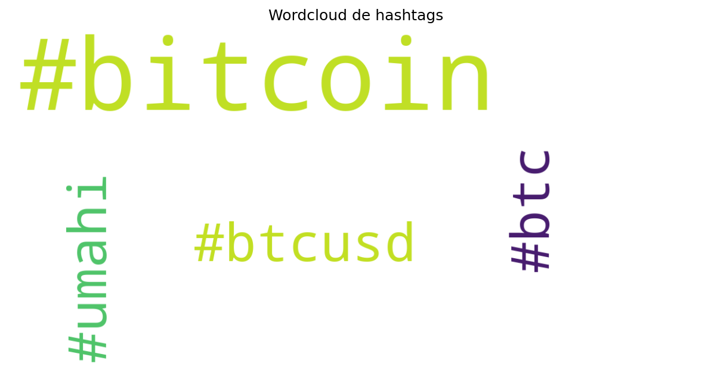
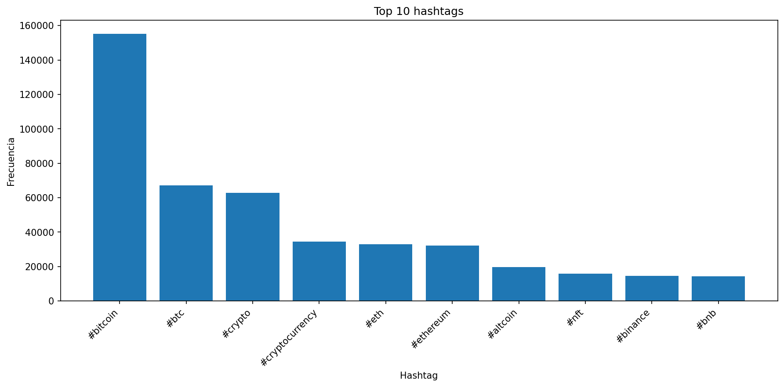
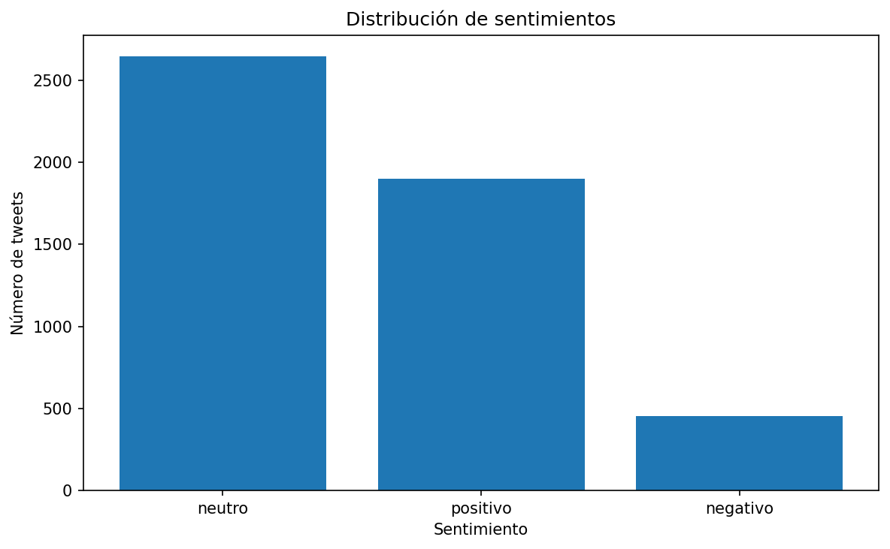
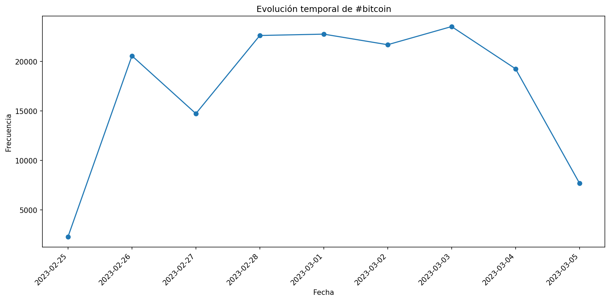

# Práctica U4 - Análisis de sentimiento y tendencias en redes sociales

## Descripción

En esta práctica se amplía el trabajo realizado en la Unidad 2,
desarrollando un pipeline completo de análisis de texto aplicado a datos
de redes sociales.

El objetivo ha sido integrar distintas técnicas de procesamiento del
lenguaje natural (NLP) sobre un mismo conjunto de datos, incluyendo
limpieza, análisis exploratorio, modelado de tópicos, análisis de
sentimiento, parsing sintáctico y generación de resúmenes.

Toda la lógica se ha organizado en torno a una clase principal
reutilizable (`DataExtractor`), que permite ejecutar el flujo completo
de forma estructurada.

Para evitar tiempos de ejecución excesivos sobre el dataset completo, 
he aplicado algunas de las técnicas a una muestra representativa del dataset. 

------------------------------------------------------------------------

## Objetivos

-   Integrar una posible conexión con una API de Twitter mediante
    RapidAPI.
-   Reutilizar el pipeline de análisis de la práctica anterior.
-   Aplicar técnicas avanzadas de análisis de texto:
    -   Modelado de tópicos (LDA)
    -   Análisis de sentimiento
    -   Parsing sintáctico
    -   Resumen extractivo
-   Generar resultados exportables y visualizaciones.
-   Documentar el proceso de forma clara y reproducible.

------------------------------------------------------------------------

## Fuente de datos

Se ha utilizado el dataset:

datasets/Bitcoin_tweets_dataset_2.csv

------------------------------------------------------------------------

## Uso de RapidAPI

Se ha implementado el método `load_data_api()` mediante el módulo
`rapidapi_client.py`, que consume **Twitter API45** en RapidAPI
(`twitter-api45.p.rapidapi.com`).

- Endpoint: `GET /search.php`
- Parámetros: `query`, `search_type` (p. ej. `Top`), `cursor` para paginar
- Respuesta: lista `timeline` y `next_cursor`

Si la API falla o no hay cuota, el script usa el CSV local como respaldo.

------------------------------------------------------------------------

## Tecnologías utilizadas

-   Python
-   pandas
-   matplotlib
-   wordcloud
-   requests
-   gensim
-   TextBlob
-   NLTK
-   spaCy

------------------------------------------------------------------------

## Ejecución

### Requisitos

- **Python 3.11** (o 3.12). El proyecto no es compatible con Python 3.14 por las
  dependencias de spaCy y el ecosistema NLP (`requires-python` en `pyproject.toml`).
- En Windows, si tienes varias versiones instaladas, usa siempre el launcher `py -3.11`.

### Instalación

Desde la carpeta del proyecto:

```powershell
py -3.11 -m pip install -r requirements.txt
```

En **Cursor / VS Code**, el intérprete queda fijado a Python 3.11 mediante
`.vscode/settings.json` (ruta estándar de instalación en Windows). Si tu Python 3.11
está en otra ruta, cámbiala en ese fichero o elige el intérprete con
*Python: Select Interpreter*.

### Configuración (opcional para API)

Crear archivo `.env` (ver `.env.example`):

```
RAPIDAPI_KEY=tu_clave
RAPIDAPI_HOST=twitter-api45.p.rapidapi.com
```

Suscríbete a [Twitter API45 en RapidAPI](https://rapidapi.com/alexanderxbx/api/twitter-api45).

### Ejecución

```powershell
py -3.11 main.py
```

Si el IDE ya usa Python 3.11 como intérprete, también puedes ejecutar `python main.py`
desde el terminal integrado.

------------------------------------------------------------------------

## Metodología

### Flujo del proyecto

1. Carga de datos (API o CSV)
2. Limpieza de texto
3. Análisis de hashtags
4. Modelado LDA
5. Análisis de sentimiento
6. Parsing y resumen
7. Exportación de resultados

### Preprocesamiento
Se realiza limpieza del texto eliminando URLs, menciones, caracteres especiales y normalizando a minúsculas.

### Modelado de tópicos
Se aplica LDA sobre una muestra del dataset, utilizando filtrado de palabras frecuentes y poco relevantes.

### Análisis de sentimiento
Se emplea TextBlob para calcular polaridad y subjetividad, clasificando los textos en positivo, negativo o neutro.


------------------------------------------------------------------------


## 📊 Análisis de resultados

### Hashtags
Los resultados muestran un claro dominio de hashtags relacionados con Bitcoin y el ecosistema cripto, destacando especialmente `#bitcoin`, `#btc` y `#crypto`. Esto indica que la conversación en Twitter está altamente concentrada en los activos principales, con menor presencia relativa de proyectos secundarios o nicho.

La nube de palabras refuerza esta idea, mostrando una fuerte repetición de términos asociados a trading, inversión y blockchain, lo que sugiere un uso mayoritariamente informativo o especulativo del contenido.

---

### Sentimiento
La distribución de sentimientos muestra un predominio del tono neutro, seguido de positivo y con una menor presencia de sentimiento negativo. Esto es coherente con el tipo de contenido analizado, donde muchos tweets son informativos (precios, actualizaciones, señales de trading) más que opiniones emocionales.

El bajo volumen de negatividad sugiere que, en el periodo analizado, no hay eventos especialmente adversos que generen reacción negativa significativa en la comunidad.

---

### Modelado de tópicos (LDA)
Los tópicos extraídos reflejan diferentes dimensiones del discurso cripto:

- Información de mercado (precios, señales, actualizaciones)
- Discusión general sobre criptomonedas y proyectos
- Contenido promocional o de engagement (`join`, `follow`, `signals`)

Esto confirma que el dataset está dominado por contenido automatizado o semiautomatizado (bots de precios y señales), lo cual influye directamente en el análisis de sentimiento y en la calidad semántica de los tópicos.

---

### Evolución temporal
El análisis temporal de `#bitcoin` muestra variaciones en la frecuencia de uso a lo largo de los días, lo que puede estar relacionado con cambios en el mercado o en la actividad de los usuarios.

No se observa una tendencia claramente creciente o decreciente, sino fluctuaciones típicas de un entorno altamente dinámico como el mercado cripto.

---

### Resumen automático
El resumen generado refleja principalmente tweets de actualización de precios y actividad de mercado, lo que confirma que este tipo de contenido es predominante en el dataset.

---

------------------------------------------------------------------------

## 📊 Visualizaciones

### Wordcloud de hashtags


### Top 10 hashtags


### Distribución de sentimientos


### Evolución temporal de #bitcoin


------------------------------------------------------------------------

## Conclusiones

Se ha construido un pipeline completo de análisis de texto, integrando
múltiples técnicas NLP en una única arquitectura reutilizable.
